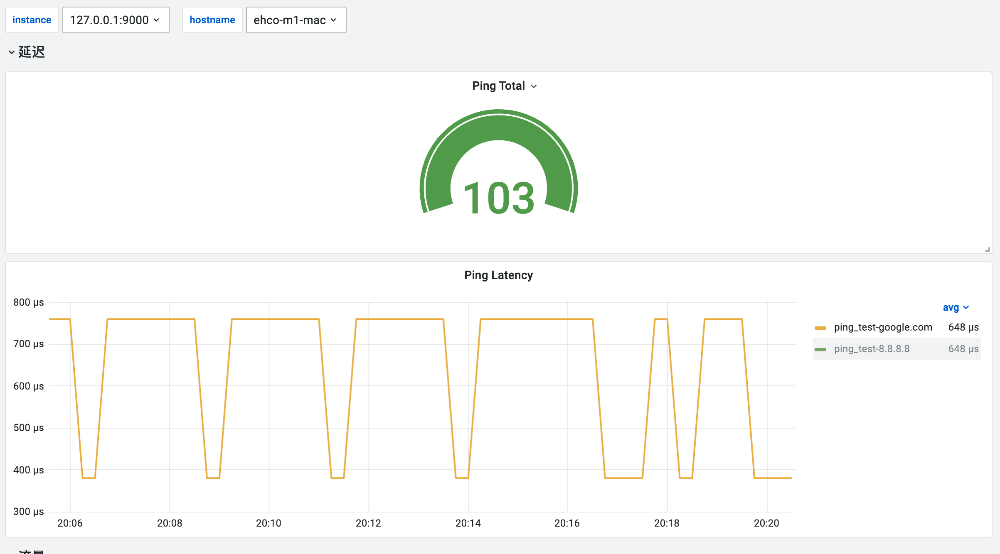
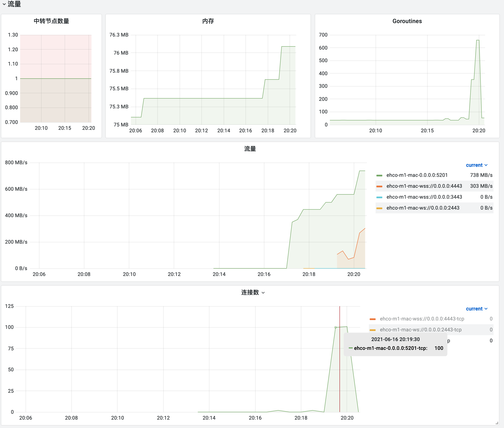

# ehco

[](https://goreportcard.com/report/github.com/Ehco1996/ehco)
[](https://pkg.go.dev/github.com/Ehco1996/ehco)
[](https://hub.docker.com/r/ehco1996/ehco)

ehco is a network relay tool and a typo :)

[see Readme in English here](README_EN.md)

## 视频安装教程

本隧道和 [django-sspanel](https://github.com/Ehco1996/django-sspanel)深度对接，可以很方便的管理中转节点

* 面板视频安装教程: [地址](https://youtu.be/BRHcdGeufvY)

* 隧道后端对接视频教程: [地址](https://youtu.be/R4U0NZaMUeY)

## 安装

### go get

```bash
go get -u "github.com/Ehco1996/ehco/cmd/ehco"
```

### 从release下载编译好的文件

> ehco 的可执行文件可以从项目的[release](https://github.com/Ehco1996/ehco/releases)页面下载

### docker image

 `docker pull ehco1996/ehco`

## 主要功能

* tcp/udp relay
* tcp relay over wss
* 从配置文件启动 支持多端口转发
* 从远程启动
* benchmark
* grafana 监控报警
* 热重载配置
* 内嵌了完整版本的 [xray](https://github.com/XTLS/Xray-core) 后端

## 使用说明

使用隧道需要至少两台主机, 并且在两台主机上都安装了ehco

* 中转机器 A 假设机器A的IP是 1.1.1.1
* 落地机器 B 假设机器B的IP是 2.2.2.2 并且落地机器B的5555端口跑着一个SS/v2ray/任意tcp/udp服务

### 案例一 不用隧道直接通过中转机器中转用户流量

直接在中转机器A上输入: `ehco  -l 0.0.0.0:1234 -r 2.2.2.2:5555`

> 该命令表示将所有从中转机器A的1234端口进入的流量直接转发到落地机器B的5555端口

用户即可通过 中转机器A的1234端口访问到落地机器B的5555端口的SS/v2ray服务了

### 案例二 用mwss隧道中转用户流量

在落地机器B上输入: `ehco  -l 0.0.0.0:443 -lt mwss -r 127.0.0.1:5555`

> 该命令表示将所有从落地机器B的443端口进入的wss流量解密后转发到落地机器B的5555端口

在中转机器A上输入: `ehco  -l 0.0.0.0:1234 -r wss://2.2.2.2:443 -tt mwss`

> 该命令表示将所有从A的1234端口进入的流量通过wss加密后转发到落地机器B的443端口

用户即可通过 中转机器A的1234端口访问到落地机器B的5555端口的SS/v2ray服务了

## 配置文件

> ehco支持从 `配置文件` / `http接口` 里读取 `json` 格式的配置并启动

配置文件格式要求如下(更多例子可以参考项目里的 [config.json](examples/config.json) 文件):

```json
{
    "web_port": 9000, // prometheus 的 web 监听端口
    "web_token": "", // 鉴权 token
    "enable_ping": false, // 是否开启 ping metrics
    "relay_configs": [
        {
            "listen": "127.0.0.1:1234", // 监听端口
            "listen_type": "raw", // 监听类型
            "transport_type": "raw", // 传输类型
            "tcp_remotes": [ // tcp转发节点 ，支持配置多个节点，配置多个节点时会自动负载均衡
                "0.0.0.0:5201"
            ],
            "udp_remotes": [
                "0.0.0.0:5201" // udp转发节点 ，支持配置多个节点，配置多个节点时会自动负载均衡
            ]
        },
    ]
}
```

### 热重载配置

> 大于 1.1.0 版本的 ehco 支持热重载配置

```sh
# 使用配置文件启动 ehco
ehco  -c config.json

# 更新配置文件后可以使用 kill -HUP pid 命令来重新加载配置
kill -HUP pid

# 重载成功可以看到如下信息
[cfg-reload] Got A HUP Signal! Now Reloading Conf ...
Load Config From file:config.json
[cfg-reload] starr new relay name=[At=127.0.0.1:12342 Over=raw TCP-To=[0.0.0.0:5201] UDP-To=[0.0.0.0:5201] Through=raw]
[relay] Close relay [At=127.0.0.1:1234 Over=raw TCP-To=[0.0.0.0:5201] UDP-To=[0.0.0.0:5201] Through=raw]
[relay] Start UDP relay [At=127.0.0.1:12342 Over=raw TCP-To=[0.0.0.0:5201] UDP-To=[0.0.0.0:5201] Through=raw]
[relay] Start TCP relay [At=127.0.0.1:12342 Over=raw TCP-To=[0.0.0.0:5201] UDP-To=[0.0.0.0:5201] Through=raw]
```

## 监控报警

* dashboard 和 prometheus 规则可以从`monitor`文件夹下找到，可以自行导入

* 类似 Smokeing Ping 的延迟监控



* 流量监控



## Benchmark(Apple m1)

iperf:

```sh
# run iperf server on 5201
iperf3 -s

# 直接转发
# run relay server listen 1234 to 9001 (raw)
go run cmd/ehco/main.go -l 0.0.0.0:1234 -r 0.0.0.0:5201

# 直接转发END

# 通过ws隧道转发
# listen 1235 relay over ws to 1236
go run cmd/ehco/main.go -l 0.0.0.0:1235  -r ws://0.0.0.0:1236 -tt ws

# listen 1236 through ws relay to 5201
go run cmd/ehco/main.go -l 0.0.0.0:1236 -lt ws -r 0.0.0.0:5201
# 通过ws隧道转发END

# 通过wss隧道转发
# listen 1234 relay over wss to 1236
go run cmd/ehco/main.go -l 0.0.0.0:1235  -r wss://0.0.0.0:1236 -tt wss

# listen 1236 through wss relay to 5201
go run cmd/ehco/main.go -l 0.0.0.0:1236 -lt wss -r 0.0.0.0:5201
# 通过wss隧道转发END

# 通过mwss隧道转发 和wss相比 速度会慢，但是能减少延迟
# listen 1237 relay over mwss to 1238
go run cmd/ehco/main.go -l 0.0.0.0:1237  -r wss://0.0.0.0:1238 -tt mwss

# listen 1238 through mwss relay to 5201
go run cmd/ehco/main.go -l 0.0.0.0:1238 -lt mwss -r 0.0.0.0:5201
# 通过mwss隧道转发END

# run through file
go run cmd/ehco/main.go -c config.json

# benchmark tcp
iperf3 -c 0.0.0.0 -p 1234

# benchmark tcp through wss
iperf3 -c 0.0.0.0 -p 1235

# benchmark upd
iperf3 -c 0.0.0.0 -p 1234 -u -b 1G --length 1024

```

| iperf | raw | relay(raw) | relay(ws) |relay(wss) | relay(mwss) | relay(mtcp) |
| ---- | ----  | ---- | ---- | ---- | ---- | ---- |
| tcp  | 123 Gbits/sec | 55 Gbits/sec | 41 Gbits/sec | 10 Gbits/sec | 5.78 Gbits/sec | 22.2 Gbits/sec |
| udp  | 14.5 Gbits/sec | 3.3 Gbits/sec | 直接转发 | 直接转发 | 直接转发 | 直接转发 |
