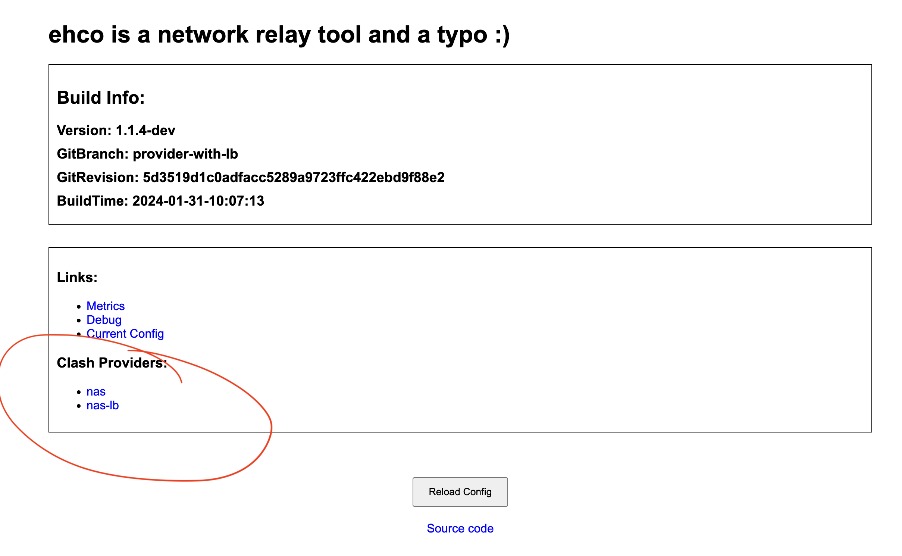
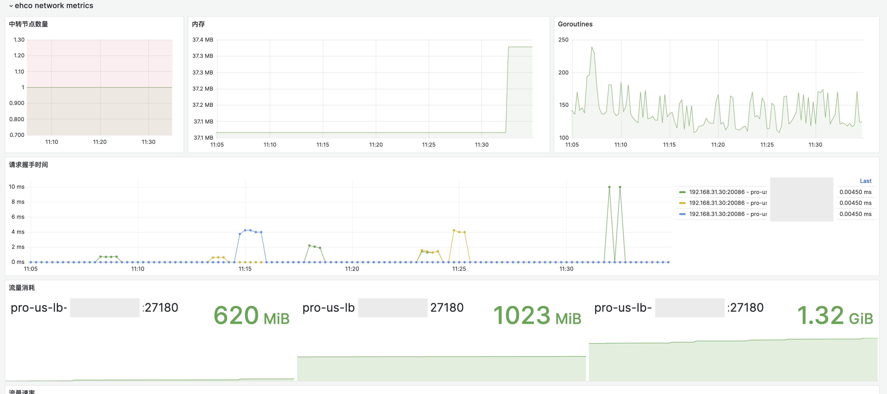

# ehco is a network relay tool and a typo :)

[](https://goreportcard.com/report/github.com/Ehco1996/ehco)
[](https://pkg.go.dev/github.com/Ehco1996/ehco)
[](https://hub.docker.com/r/ehco1996/ehco)

[see Readme in English here](README_EN.md)

## 使用场景

<details> <summary>连接内网服务</summary>

本地无法链接集群内的服务,可以通过 ehco 将本地流量转发到集群内,方便本地开发和调试

e.g. 本地开发调试连接内网服务 db, db host: xxx-rds.xxx.us-east-1.rds.amazonaws.com

1. 在 k8s 内 启动一个 ehco pod. 启动命令如下:
   `ehco -l 0.0.0.0:3306 -r xxx-rds.xxx.us-east-1.rds.amazonaws.com:3306`

2. 使用 kube port-forward 将本地的 3306 端口转发到 ehco pod 的 3306 端口
   `kubectl port-forward pod/ehco-pod 3306:3306`

3. 本地使用客户端连接
   `mysql -h 127.0.0.1:3306 -u root -p`
       </details>

<details> <summary>中转 proxy 客户端,提供负载均衡功能</summary>

从 **v1.1.4-dev(nightly)** 开始, ehco 支持了从 clash proxy provider 读取 proxy 配置并复写成 ehco 的 relay 配置
从而实现了 ehco 作为代理客户端的前置代理,提供负载均衡,流量监控等功能

e.g.

1. 配置 ehco 的 config.json 并启动

```json
{
    "web_host": "12.0.0.1",
    "web_port": 9000,
    "sub_configs": [
        {
            "name": "nas",
            "url": "your url"
        }
    ]
}
```

`ehco -c config.json`

2. 访问 ehco 的 web 界面 获取 ehco 的 proxy provider url

`http://<web_host>:<web_port>`



ehco 会将每个 clash proxy provider 转换成两个新 clash provider

-   会将每个的 proxy 转换成一个 relay
-   会将 proxy 按最长前缀**分组**,并将每个分组转换成开启负载均衡的 relay

举个例子

```yaml
proxies:
    - name: us-1
      server: s1
      password:
      port: 1
    - name: us-2
      server: s2
      port: 2
    - name: jb-1
      server: s3
      password: pass
      port: 3
```

上面这个包含 3 个 proxy 的会被转换成 5 个 relay:

-   us-1 relay to s1:1
-   us-2 relay to s2:2
-   jb-1 relay to s3:3
    us-lb relay to s1:1,s2:2
-   jb-1-lb relay to s3:3

3. 将 ehco 的 proxy provider url 配置到 clash 的配置文件中

```yaml
proxy-providers:
    ehco:
        type: http
        url: http://<web_host>:<web_port>/clash_proxy_provider/?sub_name=<name>
    ehco-lb:
        type: http
        url: http://<web_host>:<web_port>/clash_proxy_provider/?sub_name=name&grouped=true
```

你就能得到一个支持负载均衡的 clash proxy client 了,并且还能在 dashboard 上看到流量监控哟


</details>

<details> <summary>WIP: 隧道连接到 proxy 集群</summary>
</details>

## 安装

-   ehco 提供预编译的的二进制 [release](https://github.com/Ehco1996/ehco/releases) 页面下载

-   ehco 提供 [nightly build](https://github.com/Ehco1996/ehco/releases/tag/v0.0.0-nightly)

-   ehco 提供 docker 镜像 `docker pull ehco1996/ehco`

## 主要功能

-   tcp/udp relay
-   tunnel relay (ws/wss/mwss/mtcp)
-   proxy server (内嵌了完整班版本的 xray)
-   监控报警 (prometheus/grafana)
-   WebAPI (http://web_host:web_port)

## 中转使用介绍

使用隧道需要至少两台主机, 并且在两台主机上都安装了 ehco

-   中转机器 A 假设机器 A 的 IP 是 1.1.1.1
-   落地机器 B 假设机器 B 的 IP 是 2.2.2.2 并且落地机器 B 的 5555 端口跑着一个 SS/v2ray/任意 tcp/udp 服务

<details> <summary>案例一 不用隧道直接通过中转机器中转用户流量</summary>
直接在中转机器 A 上输入: `ehco  -l 0.0.0.0:1234 -r 2.2.2.2:5555`

> 该命令表示将所有从中转机器 A 的 1234 端口进入的流量直接转发到落地机器 B 的 5555 端口

用户即可通过 中转机器 A 的 1234 端口访问到落地机器 B 的 5555 端口的 SS/v2ray 服务了

</details>

<details> <summary>案例二 用 mwss 隧道中转用户流量</summary>
在落地机器 B 上输入: `ehco  -l 0.0.0.0:443 -lt mwss -r 127.0.0.1:5555`

> 该命令表示将所有从落地机器 B 的 443 端口进入的 wss 流量解密后转发到落地机器 B 的 5555 端口

在中转机器 A 上输入: `ehco  -l 0.0.0.0:1234 -r wss://2.2.2.2:443 -tt mwss`

> 该命令表示将所有从 A 的 1234 端口进入的流量通过 wss 加密后转发到落地机器 B 的 443 端口

用户即可通过 中转机器 A 的 1234 端口访问到落地机器 B 的 5555 端口的 SS/v2ray 服务了

</details>

## 内嵌 Xray 功能介绍

<details> <summary>ehco 内的 xray 服务端</summary>
从 `v1.1.2` 开始，ehco 内置了完整版本的 [xray](https://github.com/XTLS/Xray-core) 后端，可以通过标准的 xray 配置文件来启动内置的 xray server, 配置的 key 为 `xray_config`：

-   单端口多用户的 ss [xray_ss.json](examples/xray_ss.json)
-   单端口多用户的 trojan [xray_trojan.json](examples/xray_trojan.json)
</details>

<details> <summary>用户流量统计</summary>

从 `v1.1.2` 开始，ehco 支持通过 api 下方用户配置和上报用户流量，配置的 key 为 `sync_traffic_endpoint`：

ehco 会每隔 60s 发送一次 GET 请求，从 `sync_traffic_endpoint` 同步一次用户配置，到 xray server 里，期望的 API 返回格式如下：

```json
{
    "users": [
        {
            "user_id": 1,
            "method": "user1",
            "password": 1024,
            "level": 1024,
            "upload_traffic": 1024,
            "download_traffic": 1024,
            "protocol": "trojan/ss"
        },
        {
            "user_id": 2,
            "method": "user1",
            "password": 1024,
            "level": 1024,
            "upload_traffic": 1024,
            "download_traffic": 1024,
            "protocol": "trojan/ss"
        }
    ]
}
```

ehco 会每隔 60s 发送一次 POST 请求至 `sync_traffic_endpoint` ，上报当前 xray server 所有用户的流量使用情况，发送的请求格式如下：

```json
{
    "data": [
        {
            "user_id": 1,
            "upload_traffic": 1024,
            "download_traffic": 1024
        },
        {
            "user_id": 2,
            "upload_traffic": 1024,
            "download_traffic": 1024
        }
    ]
}
```

需要注意的是，如果想使用此功能，对 xray 的完整配置文件有如下限制

-   的配置文件必须包开启 `stats` 和 `api` 功能
-   ss inbound 的 `tag` 必须为 `ss_proxy`
-   trojan inbound 的 `tag` 必须为 `trojan_proxy`

一个完整的例子可以参考 [xray_ss.json](examples/xray_ss.json) 和 [xray_trojan.json](examples/xray_trojan.json)

</details>

## 配置文件格式

> ehco 支持从 `配置文件` / `http接口` 里读取 `json` 格式的配置并启动
> (更多例子可以参考项目里的 [config.json](examples/config.json) 文件):

<details> <summary>热重载配置</summary>

-   大于 1.1.0 版本的 ehco 支持热重载配置
-   通过 `kill -HUP pid` 信号来热重载配置
-   通过配置 `reload_interval` 来指定配置文件的路径
-   通过访问 POST `http://web_host:web_port/reload/` 接口来热重载配置
</details>

## 监控报警

-   dashboard 和 prometheus 规则可以从`monitor`文件夹下找到，可以自行导入

-   类似 Smokeing Ping 的延迟监控


-   流量监控


## Benchmark(Apple m1)

iperf:

```sh
# run iperf server on 5201
iperf3 -s

# 直接转发
# run relay server listen 1234 to 9001 (raw)
go run cmd/ehco/main.go -l 0.0.0.0:1234 -r 0.0.0.0:5201

# 直接转发END

# 通过ws隧道转发
# listen 1235 relay over ws to 1236
go run cmd/ehco/main.go -l 0.0.0.0:1235  -r ws://0.0.0.0:1236 -tt ws

# listen 1236 through ws relay to 5201
go run cmd/ehco/main.go -l 0.0.0.0:1236 -lt ws -r 0.0.0.0:5201
# 通过ws隧道转发END

# 通过wss隧道转发
# listen 1234 relay over wss to 1236
go run cmd/ehco/main.go -l 0.0.0.0:1235  -r wss://0.0.0.0:1236 -tt wss

# listen 1236 through wss relay to 5201
go run cmd/ehco/main.go -l 0.0.0.0:1236 -lt wss -r 0.0.0.0:5201
# 通过wss隧道转发END

# 通过mwss隧道转发 和wss相比 速度会慢，但是能减少延迟
# listen 1237 relay over mwss to 1238
go run cmd/ehco/main.go -l 0.0.0.0:1237  -r wss://0.0.0.0:1238 -tt mwss

# listen 1238 through mwss relay to 5201
go run cmd/ehco/main.go -l 0.0.0.0:1238 -lt mwss -r 0.0.0.0:5201
# 通过mwss隧道转发END

# run through file
go run cmd/ehco/main.go -c config.json

# benchmark tcp
iperf3 -c 0.0.0.0 -p 1234

# benchmark tcp through wss
iperf3 -c 0.0.0.0 -p 1235

# benchmark upd
iperf3 -c 0.0.0.0 -p 1234 -u -b 1G --length 1024
```

```
| iperf | raw            | relay(raw)    | relay(ws)    | relay(wss)   | relay(mwss)    | relay(mtcp)    |
| ----- | -------------- | ------------- | ------------ | ------------ | -------------- | -------------- |
| tcp   | 123 Gbits/sec  | 55 Gbits/sec  | 41 Gbits/sec | 10 Gbits/sec | 5.78 Gbits/sec | 22.2 Gbits/sec |
| udp   | 14.5 Gbits/sec | 3.3 Gbits/sec | 直接转发     | 直接转发     | 直接转发       | 直接转发       |

```
